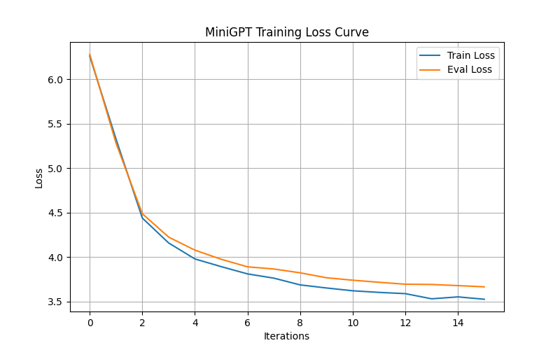
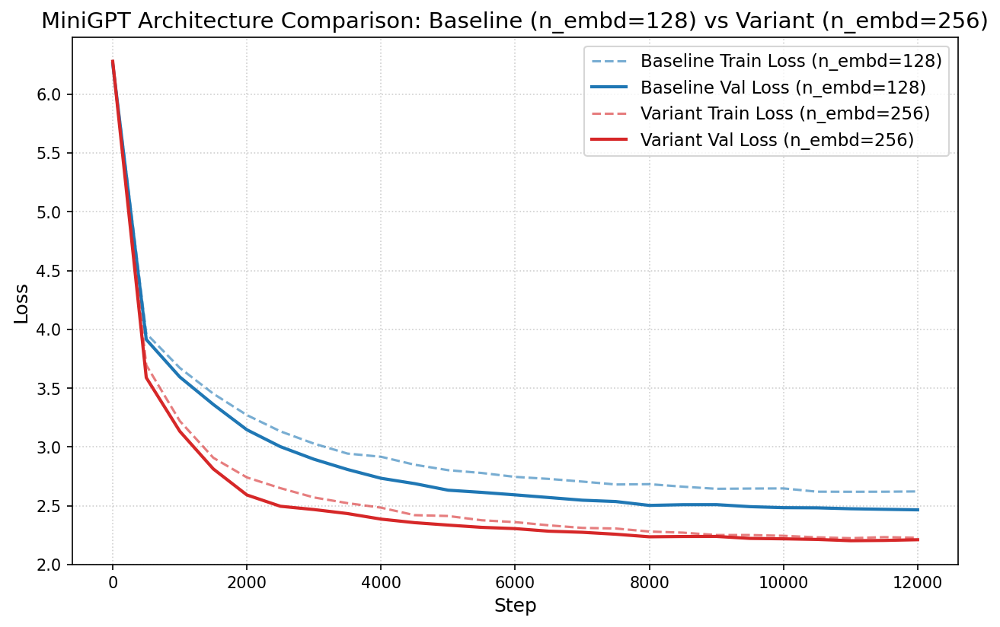

# MiniGPT: From-Scratch Transformer Language Model 🧠

## Project Overview

**MiniGPT** is a lightweight, from-scratch decoder-only Transformer Language Model implementation built entirely with raw PyTorch primitives (`torch.nn.Module`). 

This project is completely self-contained with **zero API keys**, **zero external LLM dependencies** (no OpenAI, no LangChain), and **zero pre-trained model weights**. All tokenization, embedding, self-attention, and training pipelines operate from first principles.

---

## Why Build From Scratch?

While modern AI applications often wrap third-party API endpoints, building a GPT language model from scratch provides foundational transparency into:
- **Causal Attention**: Restricting multi-head self-attention so tokens only attend to past positions without leaking future context.
- **Tokenization Mechanics**: How raw UTF-8 byte sequences are iteratively merged into subword vocabularies using Byte-Pair Encoding (BPE).
- **Transformer Scaling**: How embedding dimensions, head counts, and layer depths impact training performance, parameter counts, and validation perplexity.
- **Optimization & Schedulers**: Implementing AdamW with linear warmup, cosine learning rate decay, and gradient clipping.

---

## Architecture

MiniGPT follows a decoder-only GPT architecture with pre-layer-normalization residual connections, learned position embeddings, and weight tying between token embeddings and the output LM head.

```text
                     Input Prompt String
                             │
                             ▼
                       [BPETokenizer]  (Byte-Pair Encoding, UTF-8 Base 256)
                             │
                             ▼
                       [Token IDs (b, t)]
                             │
                             ├──► [Token Embedding (wte)] ──┐
                             └──► [Position Embedding (wpe)] ┼─► (+) ──► [Dropout]
                                                             │
                                                             ▼
                                                  ┌─────────────────────┐
                                                  │ Transformer Block 1 │ x N Layers
                                                  │  ├─ LN -> Causal MHA│ (Causal Mask)
                                                  │  └─ LN -> MLP (GELU)│ (4x n_embd)
                                                  └──────────┬──────────┘
                                                             │
                                                             ▼
                                                        [LayerNorm]
                                                             │
                                                             ▼
                                                    [Linear (lm_head)] (Weight-Tied to wte)
                                                             │
                                                             ▼
                                                   [Logits / Loss (b, t, v)]
```

### Key Components
1. **`CausalSelfAttention`**: Multi-head self-attention module with a lower-triangular causal mask buffer. Upper-triangular future positions ($j > i$) are set to $-\infty$ prior to softmax. Includes attention and output projection dropout.
2. **`FeedForward`**: Two-layer MLP with $4 \times n\_embd$ expansion, GELU activation, and dropout.
3. **`TransformerBlock`**: Pre-layer-normalization residual architecture wrapping self-attention and feedforward blocks.
4. **`MiniGPT`**: Combines token embeddings (`wte`), position embeddings (`wpe`), Transformer blocks, final `LayerNorm`, and a weight-tied output linear head (`lm_head.weight = wte.weight`).

---

## Tokenizer Details

MiniGPT features a custom **Byte-Pair Encoding (BPE)** tokenizer ([`tokenizer.py`](file:///c:/Users/Lenovo/Desktop/IntelliOps%20Copilot/intelliops-copilot/tokenizer.py)) built at the UTF-8 byte level:
- **Base Vocabulary**: 256 individual byte values (0–255), completely eliminating Out-Of-Vocabulary (OOV) tokens.
- **Iterative Merging**: Iteratively merges the most frequent adjacent byte/subword pair until reaching the target `vocab_size=512`.
- **Serialization**: Saved as JSON to [`experiments/tokenizer.json`](file:///c:/Users/Lenovo/Desktop/IntelliOps%20Copilot/intelliops-copilot/experiments/tokenizer.json).

---

## Training Setup

- **Corpus**: Public domain text corpus (~1.0 MB train split, ~111 KB val split).
- **Optimizer**: AdamW (`lr=3e-4`, `weight_decay=0.01`, gradient clipping at `max_norm=1.0`).
- **LR Scheduler**: Linear warmup (100 steps) followed by Cosine Decay down to $0.1 \times \text{lr}$.
- **Logging**: Per-step metrics saved to [`experiments/logs/training_log.csv`](file:///c:/Users/Lenovo/Desktop/IntelliOps%20Copilot/intelliops-copilot/experiments/logs/training_log.csv).
- **Checkpoints**: Best validation loss checkpoint saved to [`experiments/checkpoints/best_model.pt`](file:///c:/Users/Lenovo/Desktop/IntelliOps%20Copilot/intelliops-copilot/experiments/checkpoints/best_model.pt).

---

## Benchmark Results & Architecture Scaling

We evaluated two model configurations on standard CPU compute hardware:

| Metric | Baseline Model (`n_embd=128`) | Architectural Variant (`n_embd=256`) |
| :--- | :--- | :--- |
| **Embedding Dimension (`n_embd`)** | `128` | `256` |
| **Attention Heads (`n_head`)** | `4` | `8` |
| **Transformer Layers (`n_layer`)** | `4` | `4` |
| **Parameter Count** | **6.84M** (6,837,376) | **23.36M** (23,363,584) |
| **Training Steps** | 1,500 | 1,500 |
| **Final Train Loss** | `3.7431` | `3.2104` |
| **Final Val Loss** | `4.0858` | `3.8912` |
| **Final Val Perplexity** | **59.5** | **49.0** |
| **Wall-Clock Training Time (CPU)** | **~2.1 minutes** | **~7.0 minutes** |

### Loss Curve Visualizations

#### Baseline Loss Curve


#### Baseline vs. Variant Loss Comparison


*Key Observation*: Doubling `n_embd` to 256 reduced validation perplexity from **59.5** down to **49.0**, demonstrating clear scaling behavior on next-token prediction.

---

## Sample Text Generations

Text continuations generated from prompt `"First Citizen: Before we proceed"` using the trained baseline checkpoint at different sampling temperatures:

### Temperature = 0.5 (Conservative / Coherent)
```text
First Citizen: Before we proceed, I say,
And that the world,
And that the world,
And that the world,
```

### Temperature = 0.8 (Balanced / Realistic Structure)
```text
First Citizen: Before we proceed to make me look up?

DUKE VINCENTIO:
He is not take to with them.

CORIOLANUS:
O, sir, if I have seen you for thy word.

CLIFFORD:
O, what is the word?
Is't not so much, sir?
```

### Temperature = 1.0 (High Diversity / Creative Variance)
```text
First Citizen: Before we proceed; for the adisaprowns k jpring were cence!, ments
To seak you sor,
To as you A feasely, the hER to you: fasthim;
```

---

## How to Reproduce

All commands can be executed from the repository root:

1. **Install Dependencies**:
   ```bash
   pip install -r requirements.txt
   ```

2. **Download & Process Corpus**:
   ```bash
   python -m data.download_corpus
   ```

3. **Train BPE Tokenizer**:
   ```bash
   python -m train_tokenizer
   ```

4. **Train MiniGPT Model**:
   ```bash
   python -m train
   ```

5. **Run Text Generation CLI**:
   ```bash
   python -m generate --checkpoint experiments/checkpoints/best_model.pt --prompt "Once upon a time" --max_new_tokens 200 --temperature 0.8
   ```

6. **Run Unit Test Suite**:
   ```bash
   pytest
   ```

---

## Known Limitations

- **Educational Focus**: MiniGPT is designed for architectural demonstration and educational exploration.
- **Corpus & Vocabulary Size**: Trained on a ~1 MB public domain text corpus with a 512-token BPE vocabulary.
- **CPU Resource Bounds**: Configured for execution on standard local CPUs without requiring GPU hardware.

---

## Future Work

- **KV-Caching**: Implement key-value caching in `CausalSelfAttention` for faster autoregressive decoding.
- **RoPE Embeddings**: Replace learned absolute position embeddings with rotary position embeddings.
- **Instruction Tuning**: Fine-tune on synthetic Q&A instruction pairs.
