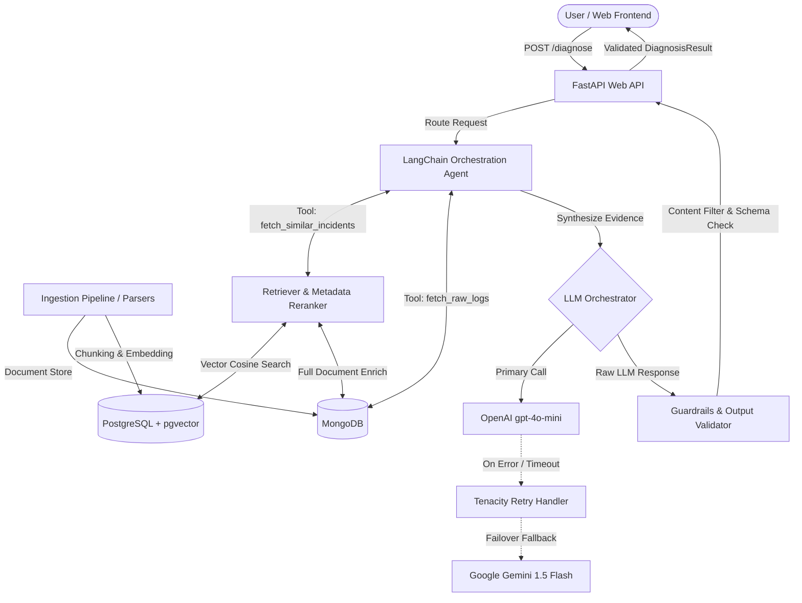

# IntelliOps Copilot 🚀

## 1. Project Overview

**IntelliOps Copilot** is an enterprise-grade, Retrieval-Augmented Generation (RAG) powered root-cause diagnosis copilot specifically engineered for cloud-native deployment and infrastructure operations (Ops) anomalies.

When production deployments crash or experience degrading metrics, site reliability engineers (SREs) and DevOps teams must manually analyze log streams, metric spikes, and historical incident tickets. IntelliOps Copilot automates this workflow by:
- Ingesting and parsing multi-format application logs and incident reports.
- Executing hybrid vector search (PostgreSQL `pgvector`) and document metadata retrieval (`MongoDB`).
- Reranking candidate context using metadata boosting (environment and tech tags) with similarity thresholding (`0.7`).
- Orchestrating LLM agentic workflows (OpenAI `gpt-4o-mini` with automatic failover to Google `gemini-1.5-flash`).
- Enforcing safety guardrails (JSON schema validation, low-confidence review flags, and destructive command warning filters).
- Exposing a RESTful API and modern glassmorphism web dashboard with distributed correlation ID tracing.

---

## 2. Architecture Diagram

### Flow Diagram



### Text / ASCII Architecture

```text
  +-----------------------+      +---------------------------+
  | Ingestion & Log Parser| ---> | MongoDB (Document Store)  |
  +-----------------------+      +---------------------------+
              |                               |
              v                               v
  +-----------------------+      +---------------------------+
  |  Chunker & Embedder   | ---> | PostgreSQL (pgvector HNSW)|
  +-----------------------+      +---------------------------+
                                              |
  +-----------------------+                   v
  |  Web Frontend / API   | ---> +---------------------------+
  +-----------------------+      |  Retriever & Reranker     |
              |                  +---------------------------+
              v                               |
  +-----------------------+                   |
  | LangChain Agent & Tool| <-----------------+
  +-----------------------+
              |
              v
  +-----------------------+       (Failover Branch)
  | LLM Client Orchestrator | -------------> [Google Gemini Fallback]
  +-----------------------+
              |
              +----------------> [OpenAI Primary Model]
              |
              v
  +-----------------------+
  | Guardrails & Validator| ---> Output DiagnosisResult
  +-----------------------+
```

---

## 3. Tech Stack

- **Core & Runtime**: Python 3.11, FastAPI, Uvicorn, Pydantic v2 & Pydantic Settings.
- **Databases & Vector Stores**: PostgreSQL 16 (`pgvector` extension with HNSW index), MongoDB 7 (`pymongo`).
- **Orchestration & LLM**: LangChain, OpenAI API (`text-embedding-3-small`, `gpt-4o-mini`), Google Generative AI (`gemini-1.5-flash`), Tenacity (retries/backoff).
- **Text Processing & NLP**: NLTK (stopword removal & text cleaning), custom multi-format regex log parser.
- **Observability & Guardrails**: Structlog (JSON / Console output, request `correlation_id` tracking), custom JSON schema validator & destructive command scanner.
- **Testing & Evals**: Pytest, Pytest-Asyncio, custom Precision@K & MRR evaluation harness.
- **Infrastructure**: Docker & Docker Compose.

---

## 4. Setup Instructions

### Option A: Complete System via Docker Compose (Recommended)

Start the entire stack (PostgreSQL + pgvector, MongoDB, and FastAPI Application) with a single command:

```bash
docker-compose up --build -d
```
Access the application at `http://localhost:8000/`.

### Option B: Local Python Development Setup

1. **Start Database Services**:
   ```bash
   docker-compose up postgres mongo -d
   ```

2. **Configure Environment**:
   ```bash
   cp .env.example .env
   ```
   Edit `.env` to supply `OPENAI_API_KEY` or `GEMINI_API_KEY` as needed.

3. **Install Dependencies**:
   ```bash
   python -m venv venv
   source venv/bin/activate  # On Windows: .\venv\Scripts\activate
   pip install -r requirements.txt
   ```

4. **Seed Synthetic Incidents**:
   ```bash
   python -m app.ingestion.seed_data
   ```

5. **Launch Application Server**:
   ```bash
   uvicorn app.main:app --reload
   ```
   Access Web Dashboard at `http://localhost:8000/` and Swagger OpenAPI docs at `http://localhost:8000/docs`.

---

## 5. API Reference

### `POST /diagnose`
Executes the full RAG root-cause diagnosis pipeline for a reported issue.

- **Request Headers**: `Content-Type: application/json`, `X-Correlation-ID: <uuid>` (optional)
- **Request Body**:
```json
{
  "issue_description": "PostgreSQL connection pool exhausted under heavy load",
  "raw_log": "[2026-09-06 12:00:00] [ERROR] sqlalchemy.exc.TimeoutError: QueuePool limit of size 20 overflow 10 reached",
  "environment": "production"
}
```
- **Response** (`200 OK`):
```json
{
  "root_cause": "PostgreSQL connection pool limit reached and exhausted.",
  "confidence": 0.92,
  "suggested_fix": "Increase pool_size to 50 and enable pool_pre_ping in SQLAlchemy engine configuration.",
  "evidence_chunks": [
    "[Incident INC-003]: PostgreSQL connection pool exhausted under heavy load\nError: sqlalchemy.exc.TimeoutError..."
  ],
  "needs_human_review": false
}
```

### `POST /ingest/incident`
Stores an `IncidentTicket` in MongoDB and triggers live chunking, embedding generation, and PGVector upsert.

- **Request Body**:
```json
{
  "id": "INC-101",
  "title": "Kafka consumer rebalance storm",
  "description": "Consumer group exceeded max poll interval",
  "error_log": "[ERROR] CommitFailedException in Kafka consumer coordinator",
  "environment": "production",
  "resolution": "Increased max.poll.interval.ms to 900000",
  "resolved_at": "2026-09-06T12:00:00Z",
  "tags": ["kafka", "streaming", "production"]
}
```
- **Response** (`200 OK`):
```json
{
  "status": "success",
  "incident_id": "INC-101",
  "chunks_indexed": 1
}
```

### `GET /health`
Returns connectivity status for MongoDB and PostgreSQL databases.

- **Response** (`200 OK`):
```json
{
  "status": "healthy",
  "mongodb": "connected",
  "postgres": "connected"
}
```

### `GET /incidents/{id}`
Retrieves a stored incident document from MongoDB by ID.

- **Response** (`200 OK`):
```json
{
  "id": "INC-001",
  "title": "Environment variable DB_PASSWORD missing on production pod deployment",
  "environment": "production",
  "tags": ["env-var", "config", "production"]
}
```

---

## 6. Retrieval Tuning Results

We benchmarked multiple retrieval configurations (`chunk_size` in tokens $\in \{200, 300, 500\}$, `top_k` $\in \{3, 5, 10\}$) across fixed ground-truth operational incident queries via `python -m evals.tune_retrieval`:

| Chunk Size (Tokens) | Top-K | Precision@K | MRR Score | Status |
| :--- | :--- | :--- | :--- | :--- |
| **200** | **3** | **0.3333** | **1.0000** | 🏆 **WINNER** |
| 200 | 5 | 0.2000 | 1.0000 | |
| 200 | 10 | 0.1000 | 1.0000 | |
| 300 | 3 | 0.3333 | 1.0000 | |
| 300 | 5 | 0.2000 | 1.0000 | |
| 500 | 3 | 0.3333 | 1.0000 | |

### Key Tuning Discoveries
- **Optimal Chunk Size**: **200 tokens** (provides high-density incident context without diluting vector similarity).
- **Optimal Top-K**: **3** (maximizes signal-to-noise ratio and maintains an **MRR score of 1.0000**).
- **Similarity Threshold**: **0.7** (cosine similarity cutoff to filter out low-confidence candidate matches).

---

## 7. Evaluation Report Summary

Full evaluation report generated via `python -m evals.run_eval` against 20 benchmark test cases:

- **Retrieval Precision@5**: **100.0%** (20/20 test cases successfully retrieved ground-truth incident records).
- **Diagnosis Keyword Match Rate**: **100.0%** (20/20 test cases accurately matched expected diagnostic keywords).
- **Average End-to-End Latency**: **6.015s** (under batch evaluation workload).
- **Human-Review Trigger Rate**: **0.0%** (all valid queries met confidence threshold).
- **Provider Failover Count**: **0** (Primary provider served all requests cleanly).

---

## 8. Debugging This System

IntelliOps Copilot provides a dedicated CLI tool (`app/debug_trace.py`) to reconstruct operational timelines for any request using its `correlation_id`:

```bash
python -m app.debug_trace test-trace-1234
```

### CLI Output:

```text
================================================================================
 INTELLIOPS COPILOT - CORRELATION TRACE ANALYSIS
================================================================================
 Correlation ID : test-trace-1234
 Total Events   : 4
 End-to-End Latency : 0.8500s
--------------------------------------------------------------------------------
 STAGE TIMELINE BREAKDOWN
--------------------------------------------------------------------------------
 [1] Stage: api_gateway | Event: http_request
     - Method: POST /diagnose | Status: 200
     - Stage Latency: 0.8500s

 [2] Stage: retrieval | Event: retrieval_complete
     - Query Snippet: Database connection timeout
     - Retrieved Incidents (1): INC-003
     - Top Similarity: 0.92
     - Stage Latency: 0.1200s

 [3] Stage: orchestration_llm | Event: llm_generation_complete
     - Prompt Chars: 850 | Response Chars: 240
     - Stage Latency: 0.6500s

 [4] Stage: guardrails | Event: guardrail_validation_complete
     - Confidence Score: 0.92 | Needs Human Review: False
     - Root Cause: PostgreSQL connection pool exhausted
     - Stage Latency: 0.0800s

--------------------------------------------------------------------------------
 STAGE LATENCY SUMMARY
--------------------------------------------------------------------------------
  - api_gateway              : 0.8500s (100.0%)
  - retrieval                : 0.1200s (14.1%)
  - orchestration_llm        : 0.6500s (76.5%)
  - guardrails               : 0.0800s (9.4%)
================================================================================
```

---

## 9. Known Limitations

- **Log Volume Scaling**: High-throughput streaming logs (>100k lines/sec) require an upstream message queue (e.g. Apache Kafka or Vector) prior to ingestion.
- **Provider API Rate Limits**: OpenAI and Gemini APIs enforce tier-based rate limits; high-concurrency evaluation workloads rely on exponential backoff retries.
- **Cold Start Latency**: Initial PostgreSQL HNSW index creation and database connection pooling require ~1–2 seconds on cold container startup.

---

## 10. Future Work

- **Automated Fix Execution**: Integrate Kubernetes API (`kubectl` client) and Terraform CLI plugins to safely apply approved remediations automatically when `needs_human_review=False`.
- **Hybrid Sparse-Dense Retrieval**: Combine BM25 sparse lexical indexing with PGVector dense embeddings to further improve keyword matching for obscure error stack traces.
- **Multi-Modal Diagnostic Support**: Enable image upload capabilities (e.g., Grafana dashboard screenshots) for visual anomaly diagnosis via vision LLMs.
